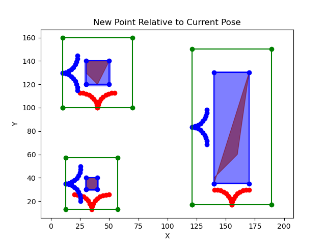
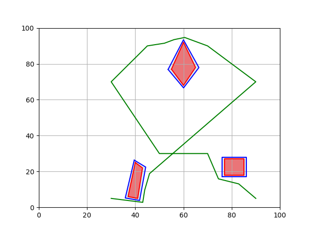
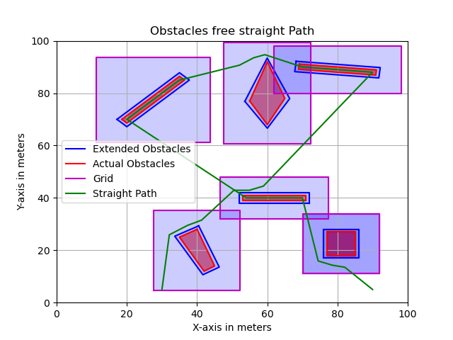
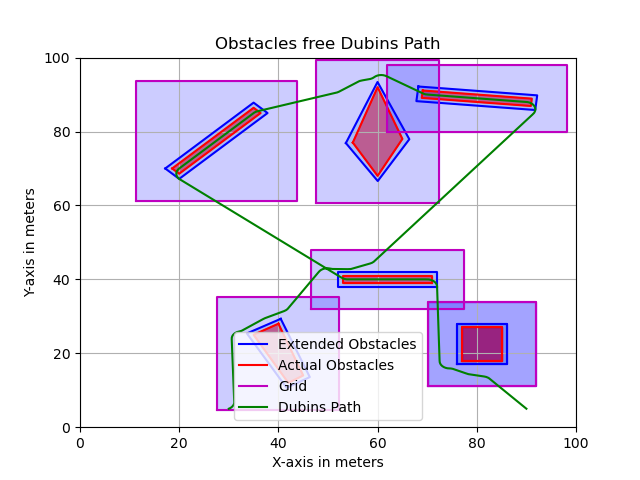

## How to execute the script.

Python3 main.py

## This is a small project focused on path planning avoiding static obstacles and marking strips in the parking lot.

- The algorithm takes input as start position, goal position, strips and obstacle vertices.

- Firstly, dynamic grids are generated based on the size of the obstacles while considering robot non-holonomic constraints. (See below figure).

- Green rectangle is the grid generated, maroon color is an obsacle and blue region is approximated obstacle.

- Blue and red curves represent non-holonomic robot constraints

- It computes the nearest strip line end point from all the strip lines and plan the shortest path to that point while avoiding obstacles.

- Once the strip point is found, it follows a straight line to mark that strip and navigate to the next nearest strip and make the previous strip an obstacle to avoid crossing the fresly marked strip. 

- After completing all the strips, it naviagte towards the goal point avoiding obstacles.

### Obstacle avoidance 

- Once an obstacle is detected in the path. The algorithm considers the point at which the path intersect with the grid of that obstacle. From that point, it will compute two salient points at the extreme edges of the obstacle and generate a graph to connect from start point to the salient point to avoid the obstacle. 

- It then uses A star algorithm to compute the shortest path to the salient point. It will then find the nearest strip and navigate towards the strip. 

### Final result

Figure 01: shows obstacles, start and goal points.

 Figure 01 

Figure 02: Demonstrates obstacles, marked strips as obstacles, and obstacles free straight path avoiding strips.

Figure 03: Dubins path avoiding obstacles.

 Figure 03 

